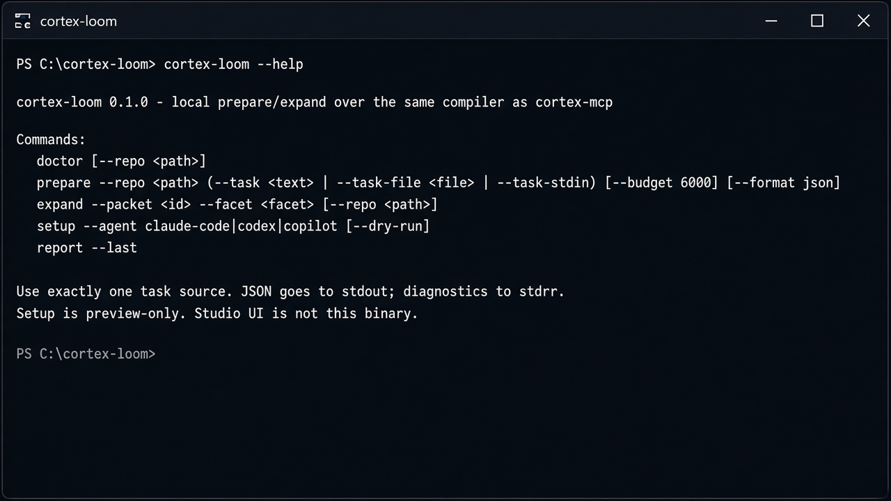
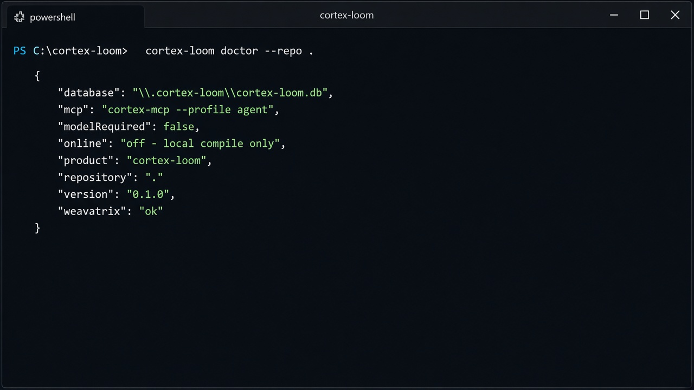
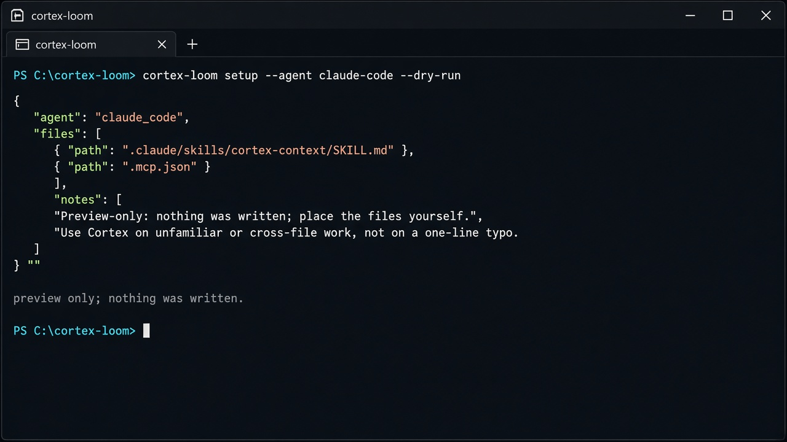

# Cortex Loom

**Task-aware repository evidence for coding agents. Bounded context. Visible gaps.**

Cortex Loom prepares a compact evidence packet for the task your coding
agent is working on. It asks
[Weavatrix](https://github.com/sergii-ziborov/weavatrix) for typed
repository facts, keeps their provenance, and reports which declared
requirements are covered, missing, contradictory, or stale.

It is local-first. No account, model download, or hosted Cortex service
is required for the deterministic path. Your coding agent still edits
and verifies the code.

CLI, MCP, and one skill are three ways to use the same compiler — not
three products.

> Cortex Loom — проверяемый компилятор контекста: модели только нужные
> факты, плюс доказательство полноты. Неизвестное не скрывается.

<p align="center">
  
</p>

<p align="center">
  
  
</p>

```text
task  →  evidence plan  →  Weavatrix  →  budgeted packet  →  coverage
                                                      ↓
                                            expand a missing facet
                                                      ↓
                                                coding agent
```

## When it helps

Use Cortex to investigate unfamiliar code, understand callers and
contracts before a cross-file change, or prepare a bounded evidence set
for debugging and review. Skip it for a typo or a small edit in a file
the agent already understands.

Cortex does not replace your agent, build a second repository index, or
filter shell output like RTK. Weavatrix supplies repository
intelligence. Cortex owns task requirements, evidence selection, and
delivery. Refactor support stays preview-only.

## Install

Product binaries are **not on crates.io** (`publish = false`). From this
repo:

```powershell
cargo install --path crates/cortex-mcp --locked
cargo install --path apps/cortex-loom --locked
cortex-loom --version
cortex-loom doctor --repo .
```

The headless path does not require Node, Studio, or a local language
model. Building from source needs Rust 1.89+ and a C toolchain.
Platforms, checksums, and the optional Studio package:
[docs/install.md](docs/install.md). CLI contract:
[docs/cli.md](docs/cli.md).

Four libraries are on crates.io (`cortex-context`, `cortex-domain`,
`cortex-router`, `cortex-skills`). They do not start the MCP server.

## Try a task without an agent

```powershell
cortex-loom prepare --repo . --task-file task.md --budget 6000 --format json
cortex-loom expand --packet <packet-id> --facet callers --format json
cortex-loom report --last
```

Use exactly one of `--task`, `--task-file`, or `--task-stdin`. JSON
goes to stdout; diagnostics to stderr. `sufficient` is coverage of
declared evidence requirements, not proof that a change is correct.
A process can exit 0 with an incomplete packet — read the certificate.

## Connect a coding agent

```powershell
cortex-loom setup --agent claude-code --dry-run
cortex-mcp --profile agent
```

Setup is preview-only. It prints `.mcp.json` / skill files and refuses
`--write`. Place them yourself. Default agent profile:

```text
cortex_prepare({ repository, task, runId?, budgetClass })
cortex_expand({ packetId, facet })
```

The `cortex-context` skill says when to call those tools. It does not
ask for Cortex on every file read and it does not use `skill_read`.

Adapters: [docs/install.md](docs/install.md#wire-a-coding-agent).
Optional classifier backends (`off` / `local` / `composer`):
[docs/llm-backends.md](docs/llm-backends.md).

## Measured work

Full tables, stamps, and caveats:
[docs/benchmark.md](docs/benchmark.md) and
[benchmarks/coding-agents](benchmarks/coding-agents).

The SweepLoom matrix at `9f2646c` uses **T1** `find_fix_bug`, **T2**
`remove_duplicate`, **T3** `split_api`. Isolation is one detached
worktree per cell. Parent-verify is the git diff plus the required
`cargo test`, not self-report.

Grok 4.6 extra high and Composer 2.5 × four Cortex classifiers × T1–T3
are closed on **cursor-agent** (24 cells). Sonnet 5 max and Haiku 4.5
T1–T2 four lanes are closed on **Claude Code CLI**. T3 and leftover
Opus CLI cells hit a Claude session limit (reset 22:40 Asia/Jerusalem
on 2026-09-16). cursor-agent Ultra remains capped until 2026-10-02.
Those are provider blocks, not Cortex failures.

Claude Code spend is usage `input + output + cache_create`. Cursor
spend is estimated context material plus visible response (chars÷4).
Do not pool them or call the drop a billed saving.

Selected models-off observations (Cursor host-reference Without vs
Cortex material estimate):

| Coding agent / task | Without score | Cortex score | Cortex spend |
| --- | ---: | ---: | ---: |
| Grok / T1 | 9.4 | 9.4 | 40,403 |
| Grok / T2 | 8.5 | 9.0 | 31,156 |
| Composer / T1 rerun | 8.2 | 9.1 | 37,205 |
| Opus extra / T1 | 9.5 | 9.6 | 51,139 |

Claude Code CLI, T1–T2 (not comparable to the Cursor numbers above):

| Agent / task / lane | Spend / score / wall / cycles |
| --- | --- |
| Sonnet T1 Without | 194,593 / 9.4 / 9m 46s / 57c |
| Sonnet T1 models-off | 76,815 / 9.1 / 3m 10s / 13c |
| Sonnet T2 Without | 75,426 / 8.8 / 3m 37s / 16c |
| Haiku T1 Without | 98,548 / 9.3 / 4m 48s / 39c |
| Haiku T1 Composer-classifier | 52,166 / 9.0 / 4m 54s / 25c |
| Haiku T2 models-off | 36,057 / 8.6 / 1m 40s / 18c |

The first Composer T1 thin-packet result stays historical at 5.0
(`is_silent_ask` unused in production). Later crate-path reruns scored
9.1–9.3; they do not erase that failure. Isolated parent-verify of the
Claude T1/T2 trees: T2 all 17/17; Haiku T1 models-off 16/1
(`silent_asks_never_name_the_product`).

RTK 0.49.0 is a bash-stdout neighbor. It is not a Cortex substitute.

### Probe — quality stamp (`restore-40-final`, 4 000 tokens)

Ten tasks, 40 facts, this repository. Historical baseline 2026-08-13
was 21 363 / 40/40. The restore stamp is **18 698 / 40/40**. Recheck
after first-pass semantic windows: **19 035 / 40/40**.

| arm | selected tokens | delivered over MCP | facts |
| --- | ---: | ---: | ---: |
| naive known directories | 403 238 | — | 40/40 |
| raw Weavatrix | 95 927 | — | 28/40 |
| Cortex targeted + source windows | 19 035 | 22 850 | **40/40** |
| **Cortex + verified source** | **19 035** | **22 936** | **40/40** |

**95.3% fewer** selected tokens than naive at equal recall.

| set | tasks / facts | cortex-source | targeted | wall | CPU | peak RSS |
| --- | ---: | ---: | ---: | ---: | ---: | ---: |
| probe @ 4k | 10 / 40 | **19 035 / 40/40** | **19 035 / 40/40** | 21.6 s | 30.8 s | 86.2 MB |
| probe @ 16k | 10 / 40 | **22 818 / 40/40** | — | 22.9 s | 14.4 s | 80.5 MB |
| core @ 4k | 7 / 41 | **14 469 / 41/41** | **14 486 / 41/41** | — | — | — |
| langs @ 4k | 6 / 12 | **4 146 / 12/12** | **4 146 / 12/12** | 10.4 s | 5.3 s | 78.3 MB |
| intent @ 4k | 3 / 12 | **4 978 / 12/12** | **4 978 / 12/12** | — | — | — |

### Live server — one question, every approach

*Who calls `compile_evidence_bundle`, and what breaks if it starts
refusing more packets?* Four declared facts, real JSON-RPC, 2026-08-10:

| approach | session tokens | calls | facts |
| --- | ---: | ---: | ---: |
| read the candidate files | 79 040 | — | 4/4 |
| `ripgrep` + file reads | 4 904 | 5 | 3/4 |
| Serena MCP 1.28.1 | 10 540 | 3 | 4/4 |
| **Cortex `--profile context`** | **4 167** | **1** | **4/4** |

### Methodology — what enters context this step?

28 declared quality/safety scenarios, synthetic evidence held constant:

| arm | methodology tokens | scenarios |
| --- | ---: | ---: |
| bundled Cortex skills | 10 401 | 3/28 |
| raw Superpowers 6.2.0 | 72 839 | 15/28 |
| **Cortex active-step packet** | **3 812** | **28/28** |

```powershell
cargo run -p cortex-bench -- --repo . --budget 4000 --set probe `
  --out .cortex-loom/bench/probe.json --stamp local-probe
```

## Models are optional

Models-off is a useful default. Calibrated local or proxy profiles can
assist inside explicit roles. They may not lower the deterministic risk
floor or mint verified evidence. Missing Qwen is not an installation
error.

| profile | role | authority |
| --- | --- | --- |
| `gpu-embedding` | Qwen3-Embedding 0.6B on OVMS/GPU | reorder inside a priority band |
| `npu-classifier` | Qwen3-8B INT4 on OVMS/NPU | escalate above the lexical floor |
| `gpu-digest` | `qwen3.5:9b` on Ollama | off-path; gate not passed |

Map: [local models](docs/local-models.md).

## Studio and workflows

Studio remains an optional interface for graphs, sequences, runs, and
docs. It is leaving this repository for a private host. A workflow
suggestion is not a claim that a step ran.

<p align="center">
  
  
</p>

## Workspace

| crate | job |
| --- | --- |
| `cortex-domain` | typed graph schema |
| `cortex-context` | budgeted packet compile |
| `cortex-router` | fail-closed routing |
| `cortex-skills` | `SKILL.md` round trip |
| `cortex-weavatrix` | plan, gather, verify, preview |
| `cortex-mcp` / `cortex-loom` | MCP transport + thin CLI |
| `cortex-eval` / `cortex-bench` | calibration and benches |

**Build:** Rust 1.89+, a C toolchain for bundled SQLite. Node is
build-time only for Studio (`npm.cmd --prefix ui run build`).

```powershell
cargo run -p cortex-mcp --release -- --profile agent
cargo run -p cortex-loom --release -- doctor --repo .
cargo test --workspace
```

Four crates are dual-licensed **MIT OR Apache-2.0** (`cortex-domain`,
`cortex-context`, `cortex-router`, `cortex-skills`). Root `LICENSE-*`
files apply **only** to those crates. Everything else is unlicensed —
see [docs/licensing.md](docs/licensing.md). That is the current grant,
not a claim that the whole product is MIT.

## Docs

[Install](docs/install.md) · [CLI](docs/cli.md) ·
[Architecture](docs/architecture.md) · [Benchmark](docs/benchmark.md) ·
[LLM backends](docs/llm-backends.md) ·
[Local models](docs/local-models.md) ·
[Competitors](docs/competitors.md)

The same files are served from a running Studio binary at `/api/docs`.
