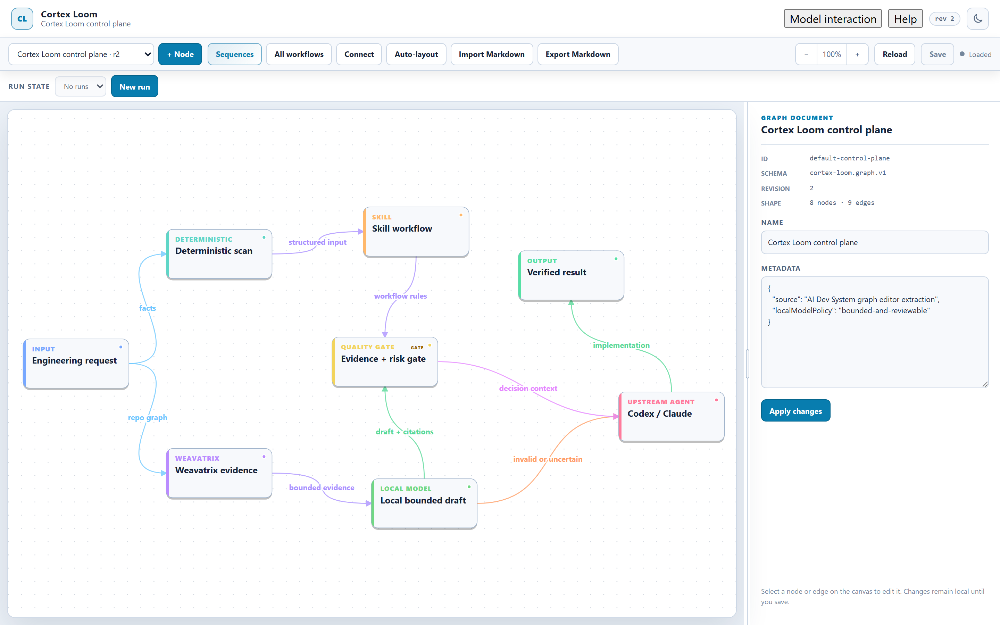
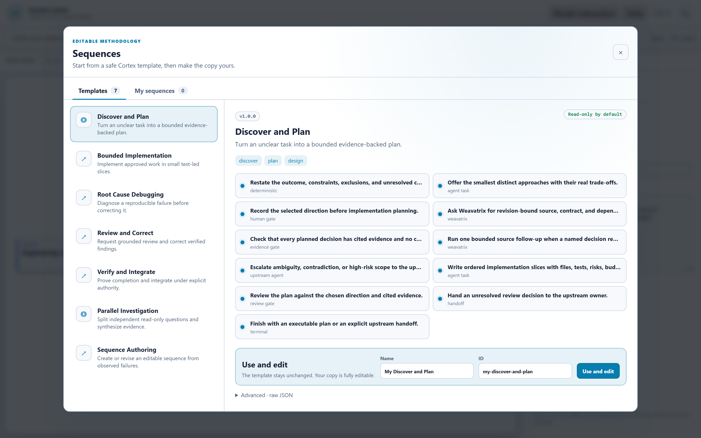
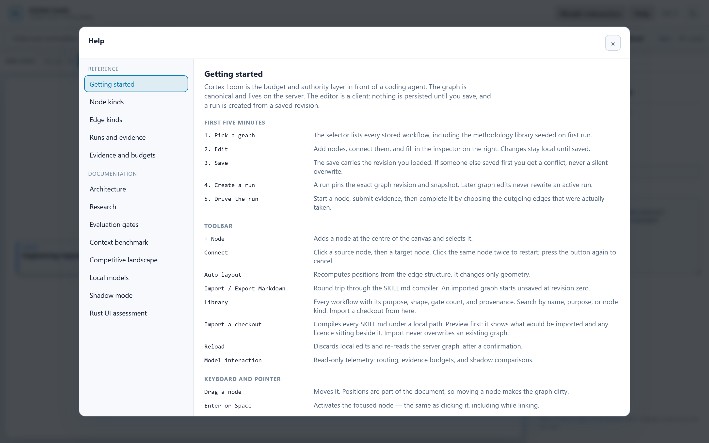

# Cortex Loom

**A verifiable context compiler for coding agents.**

Cortex Loom compiles a task-complete, revision-bound evidence packet
and proves which required facts are present, missing, contradictory,
or stale. It gives the model only the facts it needs — and does not
hide the unknown.

It sits between a repository and Codex, Claude, or Copilot. It asks
[Weavatrix](https://github.com/sergii-ziborov/weavatrix) for typed
code evidence, packs what the current task can use, and leaves
mutation, risk, and unverified work to the upstream agent.

It is a local control plane: a typed process graph, a budgeted evidence
compiler, fail-closed routing, and an MCP / HTTP / browser surface over
the same contracts. It is not a second indexer, not an autonomous coder,
and not a Superpowers fork.

> Cortex Loom — проверяемый компилятор контекста: модели только нужные
> факты, плюс доказательство полноты. Неизвестное не скрывается.

<p align="center">
  
</p>

<p align="center">
  
  
</p>

```text
task  →  route (risk floor)
      →  one active sequence step (optional)
      →  Weavatrix ops chosen from the question
      →  sufficiency gate (one retry, then escalate)
      →  compact packet + citations
      →  upstream agent
```

## Why it exists

Agents waste tokens on two things this project measures separately:

1. **Repository evidence.** Opening the right files, or dumping a whole
   graph, is accurate and expensive. Search without source windows is
   cheap and incomplete.
2. **Methodology prose.** Eager skill injection (`using-superpowers` plus
   a full `SKILL.md`) adds thousands of tokens before any code is read.

Cortex compiles one packet per turn. The rest of the workflow stays
graph state. Local models may classify, extract, or order evidence only
inside a gated role; they never lower the risk floor and never apply a
refactor.

## What you get

- **Evidence compiler** — task-aware Weavatrix plan (search, symbols,
  callers, modules, endpoints, source windows, git history, stack-trace
  mapping, test selection, prior-run memory), one sufficiency retry, then
  a fail-closed compile with stable citation IDs.
- **`--profile agent` (default)** — two MCP tools, `cortex_prepare` and
  `cortex_expand`. Generated adapters launch this. The caller sends
  `{ repository, task, runId?, budgetClass }`; mutation and verification
  are derived, never self-declared.
- **`--profile context`** — the bench evidence-compile pair
  (`context_compile`, `weavatrix_context_compile`), 454 schema tokens.
- **`--profile full`** — Studio/admin, 27 tools and ~4 021 schema tokens.
- **Seven editable sequences** — Cortex rewrites of 13 useful mechanic
  *names* (plan, TDD, debug, review, verify, parallel work, authoring).
  Typed nodes, evidence gates, Weavatrix edges. Not a 1:1 port of
  Superpowers `SKILL.md` bodies.
- **Studio** at `http://127.0.0.1:43817` — graph canvas, Sequence Studio,
  run workbench, library, Help, and the same design docs served from the
  binary.
- **Preview-only refactor** — an upstream-authored Weavatrix plan is
  validated and rendered in memory. Nothing is applied.
- **Calibration, not vibes** — `cortex-eval` never pulls a model.
  `gatePassed` is a historical flag. Semantic ordering requires a matching
  calibration artifact, not that boolean. Fine-tune rows live in
  `corpora/train` and `corpora/dev`; gold stays in `eval/public` and
  `crates/cortex-eval/fixtures/`. A leakage check refuses exact-hash and
  gold-family overlap.

## Install

Libraries (crates.io): `cargo add cortex-context cortex-domain cortex-router cortex-skills`.

Product binaries are **not on crates.io yet** (`publish = false`). From
this repo:

```powershell
npm.cmd --prefix ui ci
npm.cmd --prefix ui run build
cargo install --path crates/cortex-mcp --locked
cargo install --path apps/cortex-server --locked
```

Studio: `cortex-server` → `http://127.0.0.1:43817`.  
MCP: `cortex-mcp --profile agent`. Full steps, env flags, and
HTTP bind: [docs/install.md](docs/install.md).

## How an agent uses it

**Not a plugin.** Claude Code, Codex, Copilot, Cursor, and any other
MCP host spawn a local `cortex-mcp` process over stdio (or Streamable
HTTP on loopback). The default `--profile agent` exposes two tools:
`cortex_prepare` and `cortex_expand`.

Adapters preview the wiring files (`.mcp.json`, Codex
`config.toml` snippet, `.vscode/mcp.json`). They never write them.
See [install](docs/install.md#wire-a-coding-agent).

```text
agent  →  cortex_prepare({ repository, task })
       →  packet + coverage certificate
       →  cortex_expand({ packetId, facet })   # only if a facet is missing
       →  upstream edit / test / commit
```

Weavatrix Refactor stays preview-only. Local models may classify or
order evidence; they never apply a change.

## Measured trials

Full tables, stamps, host, and caveats:
[docs/benchmark.md](docs/benchmark.md). Comparative numbers use the
four-character unit. Runtime compile uses `conservative/v1`. Recall
means declared literals were in the packet, not that a model answered.

Host for the 2026-08-15 runs: Windows 11, Intel Core Ultra 7 255U
(14 threads), 47.5 GB RAM, Intel Graphics. **No NVIDIA device.** The
context bench does not use the GPU.

### Probe — quality stamp (`restore-40-final`, 4 000 tokens)

Ten tasks, 40 facts, this repository. Historical baseline
2026-08-13 was 21 363 / 40/40. This stamp is **18 698 / 40/40**
(same facts, compact dependents render — not a cheaper counter).

| arm | selected tokens | delivered over MCP | facts |
| --- | ---: | ---: | ---: |
| naive known directories | 398 441 | — | 40/40 |
| raw Weavatrix | 95 927 | — | 28/40 |
| Cortex targeted | 9 282 | 12 231 | 29/40 |
| **Cortex + verified source** | **18 698** | **22 794** | **40/40** |

**95.3% fewer** selected tokens than naive at equal recall. Targeted
is cheaper and drops 11 facts — do not ship it as the quality arm.

| set | tasks / facts | cortex-source | wall | CPU | peak RSS |
| --- | --- | ---: | ---: | ---: | ---: |
| probe @ 4k | 10 / 40 | **18 698 / 40/40** | 14.9 s | 13.8 s | 83.5 MB |
| probe @ 16k | 10 / 40 | **22 818 / 40/40** | 22.9 s | 14.4 s | 80.5 MB |
| core @ 4k | 7 / 41 | 12 998 / **29/41** | 15.9 s | 6.2 s | 80.6 MB |
| langs @ 4k | 6 / 12 | 2 973 / **12/12** | 8.6 s | 4.1 s | 79.5 MB |

Core is a harder fixture set (29/41 is not the quality stamp). Langs
are tiny checked-in samples — naive is cheap there because the files
are tiny, not because dumping a repo is free. Sampler:
`scripts/measure-bench.ps1`.

### Live server — one question, every approach

*Who calls `compile_evidence_bundle`, and what breaks if it starts
refusing more packets?* Four declared facts, real JSON-RPC, 2026-08-10,
later compact text rendering:

| approach | session tokens | calls | facts |
| --- | ---: | ---: | ---: |
| read the candidate files | 79 040 | — | 4/4 |
| `ripgrep` + file reads | 4 904 | 5 | 3/4 |
| Serena MCP 1.28.1 | 10 540 | 3 | 4/4 |
| **Cortex `--profile context`** | **4 167** | **1** | **4/4** |

Equal recall to reading the files, one round trip. Schema for that
profile is 454 tokens versus ~4 000 for the full MCP surface.

### Live model — does a 9B still answer?

Unfamiliar repo `weavatrix-search` @ `50953b3`, `qwen3.5:9b`, temperature
0, three questions (12 required claims). After source follow-up, labels,
and packet consumption:

| approach | quality | session tokens | calls |
| --- | ---: | ---: | ---: |
| naive: read the module dirs | 10/12 | 17 580 | 0 |
| weavatrix MCP, raw dump | 10/12 | 40 680 | 9 |
| **Cortex, labeled packet** | **10/12** | **~7–11k** | **3** |
| agent-native + Superpowers | 8/12 | 34 279 | 12 |
| Serena MCP | 5/12 | 20 768 | 6 |

Cheapest arm that matches the 10/12 quality ceiling of naive / raw
graph. One-shot T2/T3 still jitters by a point; that is recorded in the
benchmark, not rounded away. `qwen3.5:4b` failed the sequence live gate
(0/12) and is not promoted.

### Methodology — what enters context this step?

28 declared quality/safety scenarios, synthetic evidence held constant:

| arm | methodology tokens | scenarios |
| --- | ---: | ---: |
| bundled Cortex skills | 10 401 | 3/28 |
| raw Superpowers 6.2.0 | 72 839 | 15/28 |
| **Cortex active-step packet** | **3 812** | **28/28** |

**94.77% vs one whole `SKILL.md` is the per-step figure.** A full
sequence sends five or six packets (~66–71% amortized). Native is scored
from its typed graph; prose arms by keyword inference — 28/28 is closer
to a consistency check than to a model bake-off.

```powershell
cargo run -p cortex-bench -- --repo . --budget 4000 --set probe `
  --out .cortex-loom/bench/probe.json --stamp local-probe

cargo run -p cortex-bench -- sequence `
  --superpowers-root C:\path\to\superpowers `
  --out .cortex-loom/bench/sequences.json
```

The Superpowers root is optional measurement input. This repo does not
vendor those files and does not train on them.

## How a request is compiled

1. A deterministic router sets a risk floor. Local models may only
   escalate.
2. An optional sequence contributes one `ActiveStepPacket` and
   `PlanHints` (intent, source follow-up, whether a change plan is
   allowed).
3. The planner picks Weavatrix operations from the task text: blast
   radius, API contracts, config, git history, stack traces, test
   selection, and prior-run failures (`WX-MEMORY`) when `runId` or the
   wording says this was already tried.
4. Source windows outrank search metadata. Critical evidence fails
   closed instead of truncating into a plausible packet.
5. Sufficiency allows one targeted retry, then upstream.

## Models

Profiles are capabilities, not permission to pull a checkpoint. Product
authority is only `config/llm-profiles.json` + `gatePassed`.

| profile | role | authority |
| --- | --- | --- |
| `gpu-embedding` | Qwen3-Embedding 0.6B on OVMS/GPU | reorder inside a priority band |
| `npu-classifier` | Qwen3-8B INT4 on OVMS/NPU | escalate above the lexical floor |
| `gpu-digest` | `qwen3.5:9b` on Ollama | off-path; gate not passed |
| `npu-micro-extract-qwen3-0.6b` | future 0.6B literal extract | disabled until its gate passes |

The Cortex 7B-class product model is that NPU 8B IR, not the Ollama
XiYanSQL 7B GGUF. OVMS and Ollama stay two servers. CPU inference is
forbidden unless opted in. Map: [local models](docs/local-models.md),
[inventory](config/model-inventory.json).

## Dependencies

**Build:** Rust 1.89+, a C toolchain for bundled SQLite. Node is
build-time only (`npm.cmd --prefix ui run build`); the release binary
embeds `ui/dist` and needs no Node at runtime.

**First-party (crates.io / sibling repos):**

| crate | role |
| --- | --- |
| [`weavatrix-rust`](https://crates.io/crates/weavatrix-rust) 2.6.0 | repository graph, search, git, memory, impact |
| [`weavatrix-edit`](https://crates.io/crates/weavatrix-edit) 0.1.7 | exact in-memory text edits |
| [`weavatrix-refactor-plan`](https://crates.io/crates/weavatrix-refactor-plan) 0.1.1 | preview-only refactor contract |
| [`mcport`](https://crates.io/crates/mcport) 0.5.0 | Tokio-free MCP stdio / Streamable HTTP |
| [`blazingly-json`](https://crates.io/crates/blazingly-json) 0.1.5 | JSON engine (aliased as `serde_json` in private crates) |

**External:** `axum` 0.8, `tokio` 1, `rusqlite` 0.40 (bundled), `serde`
1, `sha2` 0.10, `ureq` 3, `tower-http` 0.7. UI: React 18 + Vite 6.

**Optional at runtime:** [Ollama](https://ollama.com) (`:11434`) and
OpenVINO Model Server on loopback for gated local profiles. Neither is
required to compile evidence.

**Not a dependency:** Superpowers, Serena, LangSmith, Python on the
product path. Training scripts under `scripts/fine-tune/` are
operator-only.

## Run from a checkout

```powershell
npm.cmd --prefix ui ci
npm.cmd --prefix ui run build
cargo run -p cortex-server --release
cargo run -p cortex-mcp --release -- --profile agent
cargo test --workspace
cargo run -p cortex-eval -- --discover
```

`cortex-eval` reports absent models and skips them. It never pulls.
Bench with CPU/RAM sampling:

```powershell
cargo build -p cortex-bench --release
powershell -File scripts/measure-bench.ps1 -Set probe -Budget 4000 `
  -Stamp local-probe -Out .cortex-loom/bench/probe.json
```

## Workspace

| crate | job |
| --- | --- |
| `cortex-domain` | typed graph schema |
| `cortex-context` | budgeted packet compile |
| `cortex-router` | fail-closed routing |
| `cortex-skills` | `SKILL.md` round trip |
| `cortex-sequences` | templates + one-step packets |
| `cortex-run` / `cortex-store` | immutable runs, SQLite |
| `cortex-weavatrix` | plan, gather, verify, preview |
| `cortex-mcp` / `cortex-server` | transports + embedded UI |
| `cortex-eval` / `cortex-bench` | calibration and benches |
| `cortex-llm` / `cortex-ollama` / `cortex-shadow` | gated local inference |

Four crates are dual-licensed **MIT OR Apache-2.0** (`cortex-domain`,
`cortex-context`, `cortex-router`, `cortex-skills`). Root `LICENSE-*`
files apply **only** to those crates. Everything else is unlicensed —
see [docs/licensing.md](docs/licensing.md).

Ecosystem: Weavatrix understands the repo, [Weavatrix
Loom](https://github.com/sergii-ziborov/weavatrix-loom) composes
capabilities, Cortex spends the agent's context. Boundaries:
[ADR-0012](https://github.com/sergii-ziborov/weavatrix-loom/blob/main/docs/adr/0012-ecosystem-boundaries.md).

## Docs

[Install](docs/install.md) · [Architecture](docs/architecture.md) ·
[Benchmark](docs/benchmark.md) · [Evaluation](docs/evaluation.md) ·
[Local models](docs/local-models.md) · [Competitors](docs/competitors.md) ·
[Research](docs/research.md)

The same files are served from a running binary at `/api/docs` and in
the editor Help panel.
